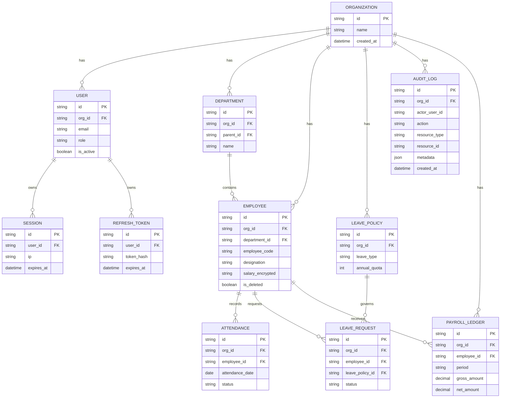

# Enterprise HRMS ER Diagram

```mermaid
erDiagram
  ORGANIZATION ||--o{ USER : has
  ORGANIZATION ||--o{ DEPARTMENT : has
  ORGANIZATION ||--o{ EMPLOYEE : has
  ORGANIZATION ||--o{ LEAVE_POLICY : has
  ORGANIZATION ||--o{ AUDIT_LOG : has
  ORGANIZATION ||--o{ PAYROLL_LEDGER : has

  USER ||--o{ SESSION : owns
  USER ||--o{ REFRESH_TOKEN : owns

  DEPARTMENT ||--o{ EMPLOYEE : contains
  EMPLOYEE ||--o{ ATTENDANCE : records
  EMPLOYEE ||--o{ LEAVE_REQUEST : requests
  LEAVE_POLICY ||--o{ LEAVE_REQUEST : governs
  EMPLOYEE ||--o{ PAYROLL_LEDGER : receives

  ORGANIZATION {
    string id PK
    string name
    datetime created_at
  }

  USER {
    string id PK
    string org_id FK
    string email
    string role
    boolean is_active
  }

  SESSION {
    string id PK
    string user_id FK
    string ip
    datetime expires_at
  }

  REFRESH_TOKEN {
    string id PK
    string user_id FK
    string token_hash
    datetime expires_at
  }

  DEPARTMENT {
    string id PK
    string org_id FK
    string parent_id FK
    string name
  }

  EMPLOYEE {
    string id PK
    string org_id FK
    string department_id FK
    string employee_code
    string designation
    string salary_encrypted
    boolean is_deleted
  }

  ATTENDANCE {
    string id PK
    string org_id FK
    string employee_id FK
    date attendance_date
    string status
  }

  LEAVE_POLICY {
    string id PK
    string org_id FK
    string leave_type
    int annual_quota
  }

  LEAVE_REQUEST {
    string id PK
    string org_id FK
    string employee_id FK
    string leave_policy_id FK
    string status
  }

  PAYROLL_LEDGER {
    string id PK
    string org_id FK
    string employee_id FK
    string period
    decimal gross_amount
    decimal net_amount
  }

  AUDIT_LOG {
    string id PK
    string org_id FK
    string actor_user_id
    string action
    string resource_type
    string resource_id
    json metadata
    datetime created_at
  }
```
